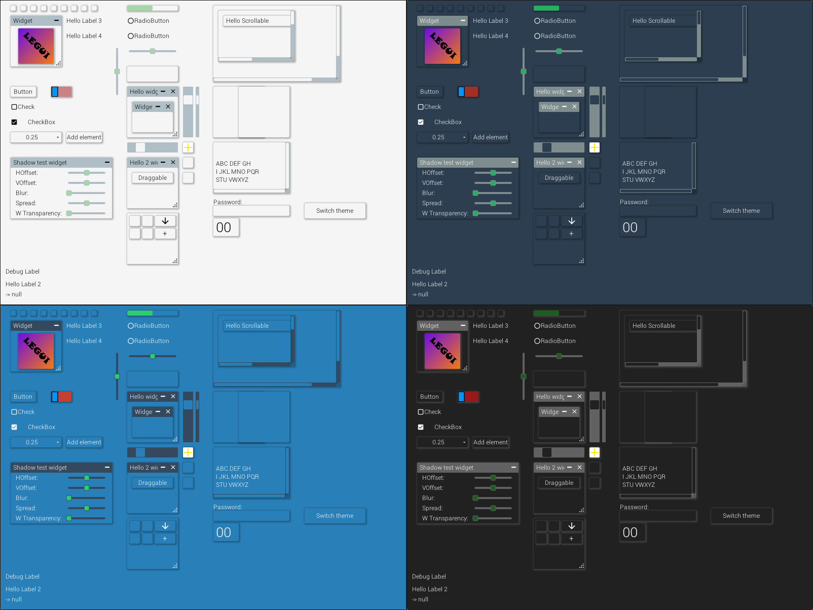

[](https://sonarcloud.io/dashboard?id=SpinyOwl_legui)
[](/LICENSE)
[](https://discord.gg/6wfqXpJ)


[%5D&colorB=blue&style=for-the-badge)](https://github.com/SpinyOwl/repo/tree/releases/com/spinyowl/legui)

___




___

# TOC

* [LEGUI - What is it?](#legui---what-is-it)
* [Contribution to LEGUI](#contribution-to-legui)
* [System requirements](#system-requirements)
* [OpenGL state touched by the backend](#opengl-state-touched-by-the-backend)
* [Usage](#usage)
*
    * [Dependencies](#dependencies)
*
    *
        * [Add dependency repo](#add-dependency-repo)
*
    *
        * [Add dependency (Maven)](#add-dependency-maven)
*
    *
        * [Add dependency (Gradle)](#add-dependency-gradle)
*
    * [Demos](#demos)
* [Projects using LEGUI](#projects-using-legui)
*
    * [Modeler by Cout970](#modeler-by-cout970)
* [Links](#links)

## LEGUI - [What is it?](https://spinyowl.github.io/legui/)

GUI implementation for using with LWJGL3.

This gui library made for using with OpenGL port (LWJGL) to allow programmers fast and easy
integrate user interface to their OpenGL apps written in Java or Kotlin.  
API is close to Swing API.

### Examples

<table>
    <tr>
        <td>Radio button and text input</td>
        <td>Widgets</td>
        <td>TextArea</td>
    </tr>
    <tr>
        <td align="center"></td>
        <td align="center"></td>
        <td align="center"></td>
    </tr>
    <tr>
        <td>Button, togglebutton, checkbox, selectbox</td>
        <td>Sliders</td>
        <td>ScrollPanel</td>
    </tr>
    <tr>
        <td align="center"></td>
        <td align="center"></td>
        <td align="center"></td>
    </tr>
</table>

## Contribution to LEGUI

See the [contribution guide](docs/CONTRIBUTING.md) for more information.

## System requirements

LEGUI requires Java 11+.

## OpenGL state touched by the backend

Default renderer made on top of NanoVG which touches following states:

When textures are uploaded or updated, the following pixel store is set to
defaults: `GL_UNPACK_ALIGNMENT`, `GL_UNPACK_ROW_LENGTH`, `GL_UNPACK_SKIP_PIXELS`
, `GL_UNPACK_SKIP_ROWS`. Texture binding is also affected. Texture updates can happen when the user
loads images, or when new font glyphs are added. Glyphs are added as needed start and end
of `render()` method.

The data for the whole frame is buffered and flushed in end of rendering. The following code
illustrates the OpenGL state touched by the rendering code:

```C
	glUseProgram(prog);
	glBlendFunc(GL_SRC_ALPHA, GL_ONE_MINUS_SRC_ALPHA);
	glEnable(GL_CULL_FACE);
	glCullFace(GL_BACK);
	glFrontFace(GL_CCW);
	glEnable(GL_BLEND);
	glDisable(GL_DEPTH_TEST);
	glDisable(GL_SCISSOR_TEST);
	glColorMask(GL_TRUE, GL_TRUE, GL_TRUE, GL_TRUE);
	glStencilMask(0xffffffff);
	glStencilOp(GL_KEEP, GL_KEEP, GL_KEEP);
	glStencilFunc(GL_ALWAYS, 0, 0xffffffff);
	glActiveTexture(GL_TEXTURE0);
	glBindBuffer(GL_UNIFORM_BUFFER, buf);
	glBindVertexArray(arr);
	glBindBuffer(GL_ARRAY_BUFFER, buf);
	glBindTexture(GL_TEXTURE_2D, tex);
	glUniformBlockBinding(... , GLNVG_FRAG_BINDING);
```

## Usage

### Dependencies

#### Add dependency repo

For using this library you should add these urls as repositories:  
For **[LWJGL](https://github.com/LWJGL/lwjgl3)** and **[JOML](https://github.com/JOML-CI/JOML)**
dependencies  
`https://oss.sonatype.org/content/repositories/snapshots/` - for snapshots  
`https://oss.sonatype.org/content/repositories/releases/` - for releases  
Also you can add your own versions of these libraries
using [LWJGL form](https://www.lwjgl.org/download).

For **LEGUI** and **[CBCHAIN](https://github.com/SpinyOwl/cbchain)** dependency  
`https://raw.github.com/SpinyOwl/repo/releases`

And add this dependency to your build script:

#### Add dependency (Maven):

 ```xml
<!-- LEGUI - https://github.com/SpinyOwl/legui -->
<dependency>
    <groupId>com.spinyowl</groupId>
    <artifactId>legui</artifactId>
    <version>${legui_version}</version>
</dependency>
 ```

#### Add dependency (Gradle):

  ```groovy
// LEGUI - https://github.com/SpinyOwl/legui
compile group: 'com.spinyowl', name: 'legui', version: "${legui_version}";
  ```

### Demos:

All examples located under [demo](/src/main/java/com/spinyowl/legui/demo/) package.

## Projects using LEGUI:

### Modeler by Cout970

> Open 3D Modeling Tool  ([Cout970/Modeler](https://github.com/cout970/Modeler))  
> This tool is written in Kotlin, using LWJGL3 for rendering and Legui to build user interfaces
<table>
  <tr>
    <td></td>
    <td></td>
  </tr>
</table>

### FMT by Fexcraft

> Fex's Modelling Toolbox  ([Fexcraft/FMT](https://github.com/Fexcraft/FMT))  
> A Tool to create Models basing on the "TMT" (updated and maintained version of Fex/FCL) Library.
<table>
  <tr>
    <td></td>
    <td></td>
  </tr>
</table>

## Links

[LWJGL - Lightweight Java Game Library 3](https://github.com/LWJGL/lwjgl3)  
[JOML – Java OpenGL Math Library](https://github.com/JOML-CI/JOML)  
[CBCHAIN - Callback Chain for LWJGL3](https://github.com/SpinyOwl/cbchain)  
[NanoVG -Small antialiased vector graphics rendering library for OpenGL.](https://github.com/memononen/nanovg)  
